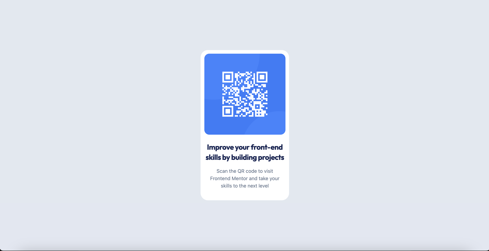
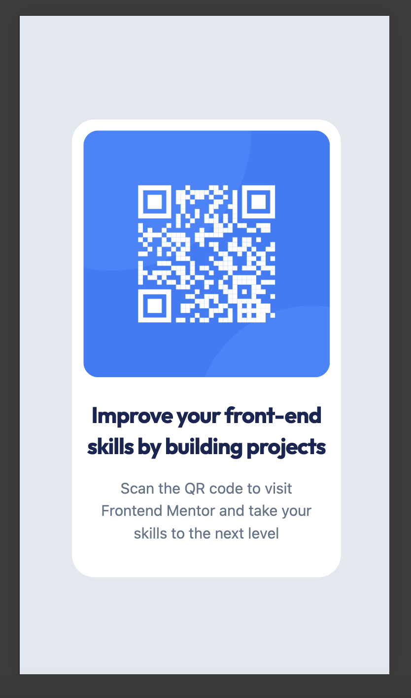

# Frontend Mentor - QR code component solution

This is a solution to the [QR code component challenge on Frontend Mentor](https://www.frontendmentor.io/challenges/qr-code-component-iux_sIO_H). Frontend Mentor challenges help you improve your coding skills by building realistic projects.

## Table of contents

- [Frontend Mentor - QR code component solution](#frontend-mentor---qr-code-component-solution)
  - [Table of contents](#table-of-contents)
  - [Overview](#overview)
    - [Screenshot](#screenshot)
    - [Links](#links)
  - [My process](#my-process)
    - [Built with](#built-with)
    - [What I learned](#what-i-learned)
    - [Continued development](#continued-development)
    - [Useful resources](#useful-resources)
  - [Author](#author)

## Overview

### Screenshot

**Desktop version**

**Mobile version**

### Links

- Live Site URL: [QR Challege in GH Pages](https://gowikel.github.io/qr-challenge/)

## My process

### Built with

- [Svelte](https://svelte.dev/)
- [Tailwind CSS](https://tailwindcss.com/)
- [Github Pages](https://pages.github.com/)

### What I learned

I am working fulltime as a full-stack developer. As such, this was an easy exercise.

However, I mainly use React on my day-to-day work. That's why I used Svelte here. I understand it was an overkill for this application, as you only need some HTML and CSS, but it was a good starting point to learn Svelte.

Futhermore, I've never used Github pages before, and I didn't know that I can upload simple SPA pages to it, as far as I don't use any backend.

### Continued development

I want to continue doing things in Svelte, and in a no long future, go deep in WebRTC technologies.

### Useful resources

- [Find Nearest Tailwind Colour](https://find-nearest-tailwind-colour.netlify.app/) - Useful to find the nearest Tailwind colour that matches the given specs.
- [HSLtoRGB](https://colordesigner.io/convert/hsltorgb)

## Author

- Frontend Mentor - [@gowikel](https://www.frontendmentor.io/profile/gowikel)
- Linkedin - [@gowikel](https://www.linkedin.com/in/gowikel/)
